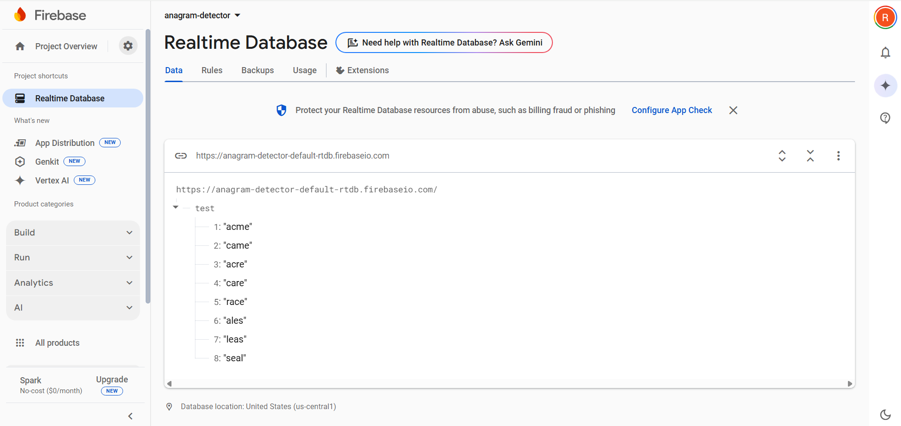

# firebase-anagram-finder
A small web app that checks for anagrams in real-time using Firebase Realtime Database



The app connects to a Firebase Realtime Database where a list of words is stored. When a user types a word, the app checks if any stored words are anagrams of the input, updating the result live. All logic runs in the browser without a server.

## 📦 Technologies

- Firebase Realtime Database
- HTML / CSS / JavaScript
- ES6 Modules

## 🔧 How to Use

1. Clone the repo:
   ```bash
   git clone https://github.com/Ramy9999/firebase-anagram-finder.git
   ```
   Or: you can download the zip file of the project and extract it to your desired location
   
3. Make sure `styles.css` and anagrams-icon.png are in the same folder as `index.html`
4. Open `index.html` in any modern ES6 browser — you're ready to go!
